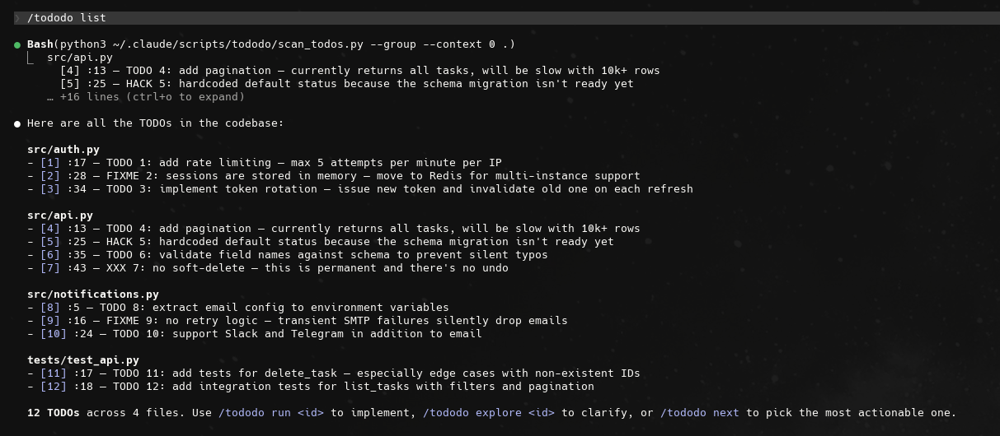
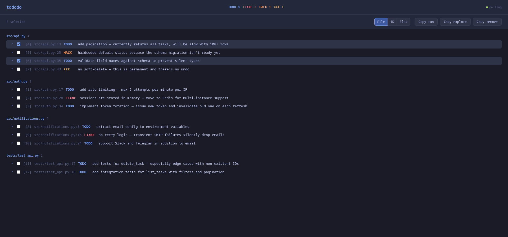

# tododo

Claude Code plugin to find, explore, and execute TODO/FIXME/HACK/XXX comments in your codebase.



## Quick Start

```
/plugin install tododo@paperos
```

Then in Claude Code:

```
/tododo            # list all TODOs
/tododo run 3      # implement TODO #3
/tododo explore    # clarify vague TODOs
```

## Features

- **`/tododo`** or **`/tododo list`** — scan and display all TODOs grouped by file
- **`/tododo run [id...]`** — implement what a TODO describes, then remove the comment
- **`/tododo explore [id...]`** — analyze vague TODOs and rewrite them with a concrete plan
- **`/tododo edit <id> <new text>`** — replace a TODO's text
- **`/tododo remove <id>`** — delete a TODO comment from the file
- **`/tododo assign-ids`** — embed stable numeric IDs into unnamed TODOs
- **`/tododo next`** — surface the most actionable TODO and offer to run it
- **`/tododo:interface`** — open a web dashboard for visual TODO selection



Also works as a **skill** — Claude automatically manages TODOs when you mention them without the slash command.

## How It Works

The bundled scanner (`scripts/scan_todos.py`) walks your project files respecting `.gitignore`, finds TODO/FIXME/HACK/XXX in common comment formats (`#`, `//`, `/* */`, `--`, `<!-- -->`, etc.), and outputs a numbered list. Claude uses this list to perform operations via the Edit tool.

**Stable IDs:** write `# TODO 42: description` to get a persistent ID that survives re-scans and file edits. Plain `# TODO: description` gets a positional counter that resets every scan — use `assign-ids` to make them permanent.

**Recommended workflow:**

```
list → explore (clarify vague ones) → run or next
```

## Installation

This plugin lives in the `paperos` marketplace.

```
/plugin install tododo@paperos
```

Or set it directly in `~/.claude/settings.json`:

```json
"enabledPlugins": { "tododo@paperos": true }
```

## Updating

```bash
cd /path/to/cc_skills && git pull
```

The marketplace is a directory source, so `git pull` on the workspace updates all plugins inside.

## Uninstalling

Set `"tododo@paperos": false` in `~/.claude/settings.json` (or remove the entry).

## Ignoring Files

Create a `.todoignore` file in your project root to exclude files from scanning. Uses gitignore syntax:

```gitignore
# Ignore generated files
dist/
build/

# Wildcard patterns
**/*.min.js
*.pb.go

# Ignore a directory anywhere in the tree
**/fixtures/
```

The file is searched upward from the project root, so you can place it in a parent directory to cover multiple projects.

## Requirements

- Python 3.10+
- Git (for `.gitignore`-aware scanning)

## License

MIT
